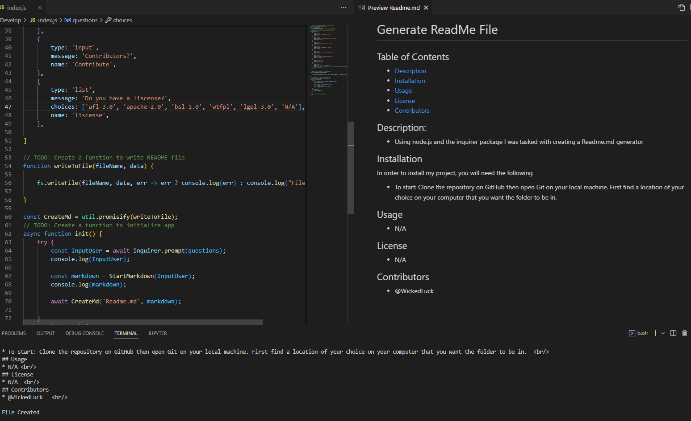

# Professional README Generator 

Challenge 9 for UoM Node.js ReadMe Generator:  

For this weeks challenge I was tasked with creating a ReadMe Generator using Node.js

- The motivation behind this project was to become more familiar with using Node.js and creating a generator that creates Readme.md files. 
 
- I built this project to advance my skills with working with node.js and learning how to use the inquirer, fs, and util packages.  

- This project resolves around having a user answer questions about their project to create a automatic Readme file. Once the user answers all questions a file is created and can be deployed/ read.    

- Completion of this project allowed for me to become more knowledgeable with node.js and installing packages 

# Installation
In order to install my project, you will need the following

- Git
- IDE with JS capabilities 

To start: 
Clone the repository on GitHub then open Git on your local machine. First find a location of your choice on your computer that you want the folder to be in.
- To change working directory, use the command cd followed by a folder or cd.. to move back  
- Using the command git clone and adding the cloned directory, you will have a copy of this project
- To deploy to your ide type code . 

# Usage 
The purpose of this project is to make a functional node application that uses node.js and the inquirer package to create a professional Readme document.  

[How to create a Professional README](https://coding-boot-camp.github.io/full-stack/github/professional-readme-guide)  
[Video](https://www.youtube.com/watch?v=njsNM1Rr_GM)
